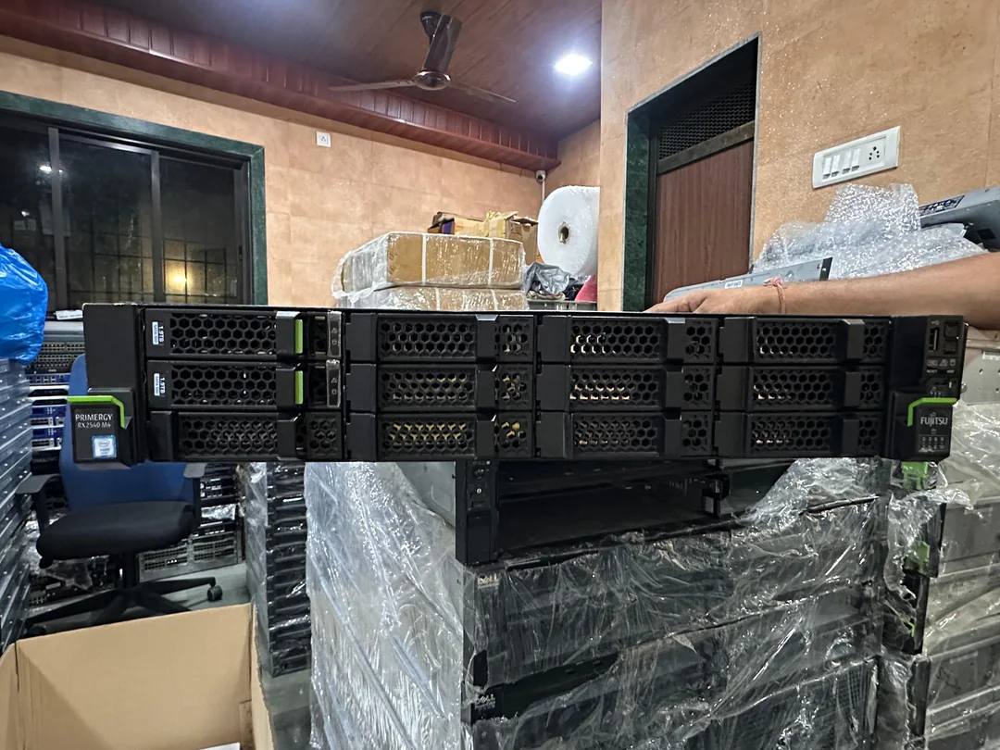
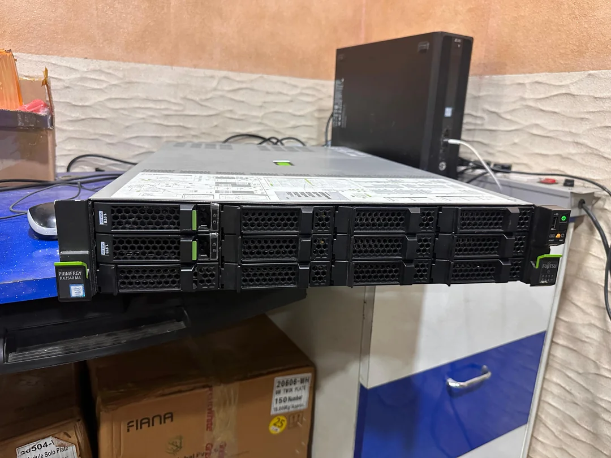
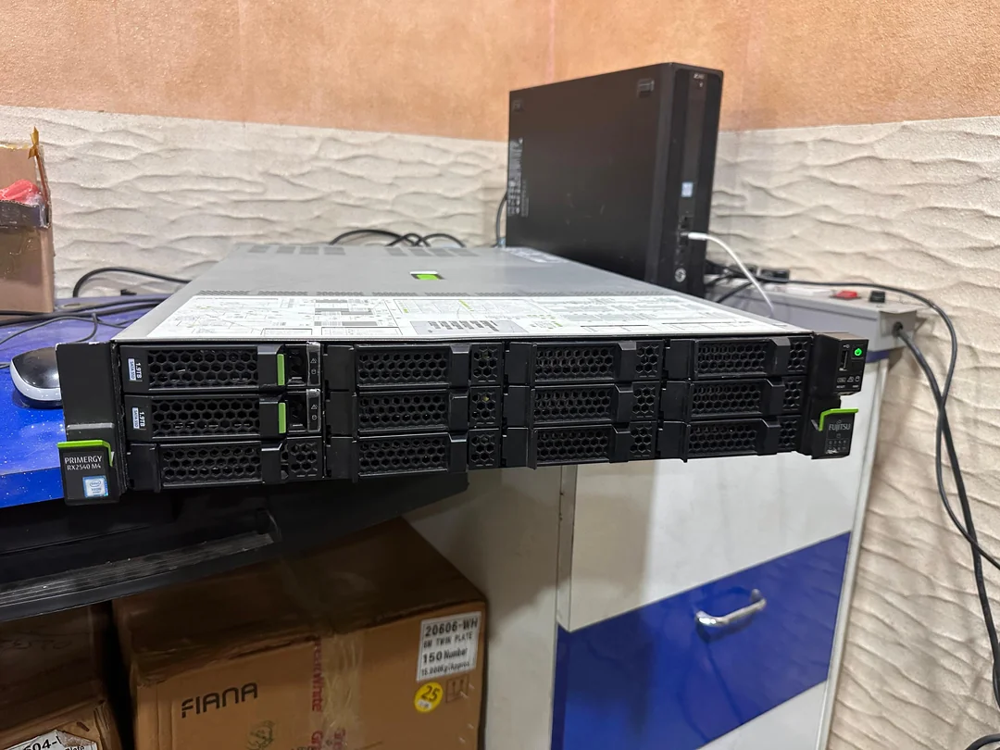

# Fujitsu Rack Server, 28 cores, 64GB DDR4 RAM - 40k

Model: Fujitsu RX2540 M4 Server  
Price: ₹40,000  

1-Intel NVMe M.2 SSD on board( two M.2 NVMe slots onboard)  
Dual redundant power supplies Raid card 12-3.5 bays front side( both 3.5 and 2.5 drives can be kept in the same caddy).
The server comes with two caddy and 10 fillers)  
Mellanox dual port 25Gig card with 1 SFP will come for 5K extra  

| Component | Description                                                      |
|-----------|------------------------------------------------------------------|
| CPU       | Dual Xeon Gold 5120 processors 28 physical and 56 virtual cores |
| RAM       | 64GB DDR4 memory                                                 |
| SSD       | 512GB NVMe                                                       |

<!-- more -->

