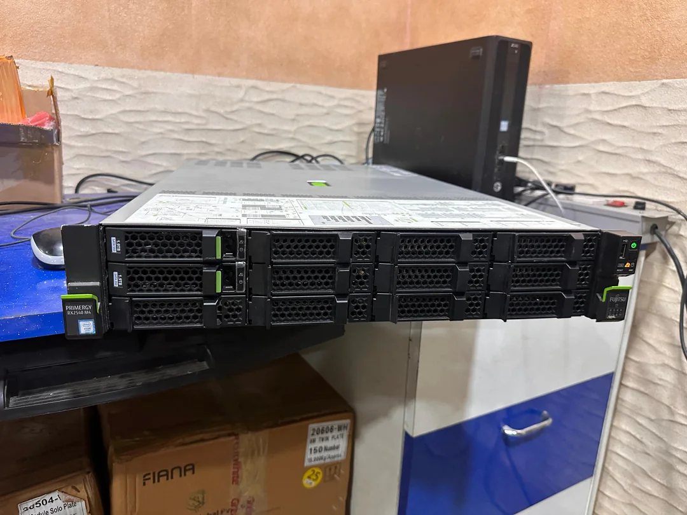
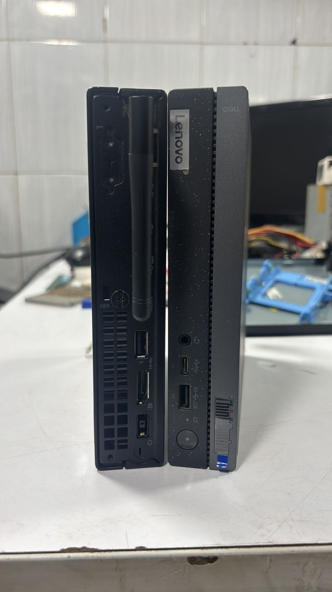
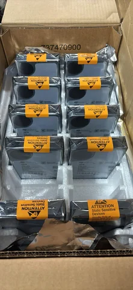

---
hide:
  - toc
---

<section class="hli-hero">
  

    
Homelab India Wiki

    <h1>Build a useful lab with parts you can actually buy.</h1>
    

      Practical hardware, networking, storage, and software notes for people running servers at home in India.
      Start with the constraint in front of you, then follow the guides into a working setup.
    

    <ul class="hli-actions">
      <li><a class="md-button md-button--primary" href="hardware/">Browse hardware</a></li>
      <li><a class="md-button" href="software/">Plan software</a></li>
      <li><a class="md-button" href="software/networking/exposing/">Expose services</a></li>
    </ul>
    <ul class="hli-signal">
      <li>ISP routing</li>
      <li>Power and heat</li>
      <li>Local deals</li>
      <li>Storage math</li>
    </ul>
  

  

    <figure class="hli-rig__primary">
      
      <figcaption>rack servers</figcaption>
    </figure>
    <figure class="hli-rig__tall">
      
      <figcaption>compact builds</figcaption>
    </figure>
    <figure class="hli-rig__small">
      
      <figcaption>storage</figcaption>
    </figure>
  

</section>

<section class="hli-band">
  

    <h2>Choose the lane you are solving today.</h2>
    

      The wiki is organized around decisions builders repeat: what to buy, how to run it,
      how to reach it from outside, and where to learn from the community.
    

  

  

    <a class="hli-lane" href="hardware/">
      
        <svg viewBox="0 0 24 24" fill="none" stroke="currentColor" stroke-width="2"><rect x="4" y="4" width="16" height="6" rx="1"/><rect x="4" y="14" width="16" height="6" rx="1"/><path d="M8 7h.01M8 17h.01M12 7h4M12 17h4"/></svg>
      
      <h3>Hardware</h3>
      
Mini PCs, routers, switches, disks, rack servers, and VPS options that make sense in the Indian market.

      Open hardware guides
    </a>
    <a class="hli-lane" href="software/">
      
        <svg viewBox="0 0 24 24" fill="none" stroke="currentColor" stroke-width="2"><path d="M8 18h8M10 22h4"/><rect x="4" y="3" width="16" height="12" rx="2"/><path d="m9 8 2 2-2 2M13 12h3"/></svg>
      
      <h3>Software</h3>
      
Operating systems, RAID and filesystems, deployment tradeoffs, and the foundations for reliable services.

      Open software guides
    </a>
    <a class="hli-lane" href="software/networking/exposing/">
      
        <svg viewBox="0 0 24 24" fill="none" stroke="currentColor" stroke-width="2"><circle cx="6" cy="12" r="3"/><circle cx="18" cy="6" r="3"/><circle cx="18" cy="18" r="3"/><path d="m8.6 10.6 6.8-3.2M8.6 13.4l6.8 3.2"/></svg>
      
      <h3>Networking</h3>
      
Expose services, handle IPv6, measure speed, and pick the access pattern that fits your ISP reality.

      Open networking guides
    </a>
    <a class="hli-lane" href="community-guides/">
      
        <svg viewBox="0 0 24 24" fill="none" stroke="currentColor" stroke-width="2"><path d="M16 11a4 4 0 1 0-8 0"/><path d="M3 21a7 7 0 0 1 18 0"/><path d="M17 4a3 3 0 0 1 2 5M7 4a3 3 0 0 0-2 5"/></svg>
      
      <h3>Community</h3>
      
Channels, creators, and contribution routes for sharing builds and keeping the wiki grounded.

      Open community guides
    </a>
  

</section>

<section class="hli-feature">
  

    

      <h2>Built for Indian homelab constraints.</h2>
      

        Global guides are useful, but a working home lab depends on local availability,
        last-mile connectivity, electricity, space, and service exposure choices.
      

    

    

      

        <strong>Start from what is easy to source.</strong>
        Mini PCs, refurbished enterprise hardware, routers, and disks are covered with practical tradeoffs.
      

      

        <strong>Make networking decisions explicit.</strong>
        Cloudflare Tunnels, VPNs, port forwarding, IPv6, and speed testing sit together instead of being scattered.
      

      

        <strong>Keep the setup maintainable.</strong>
        The software section favors repeatable systems, clear storage choices, and boring recovery paths.
      

    

  

</section>

<section class="hli-band">
  

    <h2>Useful starting points.</h2>
    
Jump into the pages that usually unblock a new build fastest.

  

  

    

      <strong>01</strong>
      <a href="hardware/minipc/">Compare mini PCs</a> before buying the first always-on machine.
    

    

      <strong>02</strong>
      <a href="software/operating-system/">Pick an operating system</a> around how much maintenance you want.
    

    

      <strong>03</strong>
      <a href="software/raid/">Plan storage</a> before a disk failure makes the lesson expensive.
    

    

      <strong>04</strong>
      <a href="software/networking/multiple-ipv6-prefixes/">Handle IPv6 prefixes</a> when your network grows up.
    

  

</section>

<section class="hli-community">
  

    

      <h2>Contribute what worked in your setup.</h2>
      

        Homelab India Wiki is community-maintained and not affiliated with r/homelabindia.
        Share fixes, buying notes, and build lessons through GitHub.
      

    

    

      <a class="md-button md-button--primary" href="https://github.com/homelabindia/wiki">GitHub</a>
      <a class="md-button" href="https://discord.gg/E2vXJBkpWr">Discord</a>
      <a class="md-button" href="https://www.reddit.com/r/HomelabIND/">r/HomelabIND</a>
    

  

</section>

