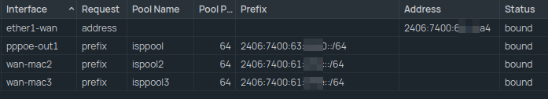

# Multiple IPv6 /64 Prefixs

In India it is currently not possible to get larger than a /64 IPv6 prefix from major ISPs. As an alternative you can request multiple /64s via DHCPv6 and use it in different VLANs.

!!! info

    draft document

Last tested: June 1 2025 with ACT  
Tested OS: OpenWRT, Microtik

## How it works

- ALL IPv6 traffic should be routed through your primary WAN's /128 IPv6 because it is authenticated via PPPoE/MAC?
- Create any number of macvlans (which basically means another interface with different mac on the same interface)

OpenWRT:

- YOU NEED TO ENABLE promecusous mode on the macvlan
- It takes 5mins to get an IPv6 prefix
- Disable source routing and default gateway on all macvlan interfaces
